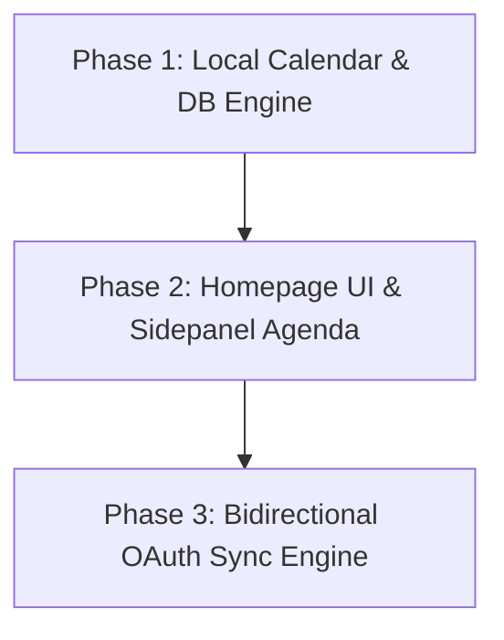

# Implementation Plan 035: Time Blocking & Unified Calendar Sync Engine

> **Current version:** 5.3.0 → **Target version:** 5.4.0 _(Major new system: Unified Calendar, two-way Google/Outlook/iCal sync, Home & Sidepanel scheduling UI; 0 breaking)_

---

## 1. Context & Objectives

To support Tabatha's shift to a full "Attention Operating System," the platform requires a robust, premium scheduling system with **Google Calendar, Outlook, and iCal parity**. This will allow Tabatha to act as an independent daily planner while maintaining seamless bidirectional synchronization with the user's existing work calendars.

### Key Deliverables:
1. **Unified Calendar Database & State Engine**: Native storage in `chrome.storage.local` with automatic backing migrations on Supabase, supporting events, recurrence rules (RRule), multi-calendar registries, and focus item bindings.
2. **Homepage Dashboard Calendar View**: A premium, full-screen calendar supporting **Month, Week, and Day views** with drag-and-drop timeline block rescheduling, drag-to-resize duration edits, and planned vs. actual time overlays.
3. **Sidepanel Schedule Surface**: Compact time-slot agenda and day-view columns inside the sidebar for quick stint planning, direct focus triggers, and meeting countdown nudges.
4. **Bi-Directional Sync Manager**: Background orchestration service using OAuth2 to fetch, merge, and push updates to Google Calendar (REST) and Microsoft Outlook (Graph API) with conflict-resolution protocols.

---

## 2. Database Schema Design

For parity and offline-first performance, native database tables will be managed via `storage.js` / Supabase postgres migrations:

### A. Calendar Tables (`tabatha_calendars`)
```sql
CREATE TABLE tabatha_calendars (
    id UUID PRIMARY KEY DEFAULT gen_random_uuid(),
    profile_id UUID REFERENCES browser_profiles(id) ON DELETE CASCADE,
    name VARCHAR(255) NOT NULL,
    color VARCHAR(7) DEFAULT '#6366f1', -- Tailwind Indigo
    provider VARCHAR(50) DEFAULT 'native', -- 'native' | 'google' | 'outlook' | 'ical'
    provider_calendar_id VARCHAR(255),
    is_writable BOOLEAN DEFAULT TRUE,
    is_visible BOOLEAN DEFAULT TRUE,
    sync_token VARCHAR(555), -- GCal/Outlook delta token
    created_at TIMESTAMPTZ DEFAULT NOW(),
    updated_at TIMESTAMPTZ DEFAULT NOW()
);
```

### B. Event Tables (`tabatha_calendar_events`)
```sql
CREATE TABLE tabatha_calendar_events (
    id UUID PRIMARY KEY DEFAULT gen_random_uuid(),
    calendar_id UUID REFERENCES tabatha_calendars(id) ON DELETE CASCADE,
    title VARCHAR(555) NOT NULL,
    description TEXT,
    start_time TIMESTAMPTZ NOT NULL,
    end_time TIMESTAMPTZ NOT NULL,
    is_all_day BOOLEAN DEFAULT FALSE,
    color_override VARCHAR(7),
    location TEXT,
    
    -- Recurrence (Google/iCal standard RFC 5545)
    rrule TEXT, -- RRULE:FREQ=WEEKLY;BYDAY=MO,WE,FR
    exdate TEXT, -- CSV of excluded timestamps
    
    -- Tabatha Attention OS Associations
    associated_focus_id VARCHAR(255), -- Link to a Tabatha Focus item
    associated_task_id UUID REFERENCES tasks(id) ON DELETE SET NULL,
    
    -- Sync Metadata
    provider_event_id VARCHAR(255), -- External event ID (Google/Outlook)
    etag VARCHAR(255), -- For optimistic concurrency locking
    last_synced_at TIMESTAMPTZ,
    created_at TIMESTAMPTZ DEFAULT NOW(),
    updated_at TIMESTAMPTZ DEFAULT NOW()
);
```

---

## 3. UI/UX Architecture

### A. Homepage Calendar Interface (`src/home/CalendarView.jsx`)
A full-screen calendar built with **Tailwind CSS 4** and **Framer Motion** for premium, high-fidelity visual interactions (glassmorphism, smooth animations, layout transitions).

```jsx
// Conceptual Architecture of src/home/CalendarView.jsx
import React, { useState, useEffect } from 'react';
import { motion, AnimatePresence } from 'framer-motion';
import { Calendar, momentLocalizer, Views } from 'react-big-calendar';
import moment from 'moment';
import 'react-big-calendar/lib/css/react-big-calendar.css';
import './calendar-styles.css'; // Premium theme overrides

const localizer = momentLocalizer(moment);

export default function CalendarView({ focusEngine, actions }) {
  const [view, setView] = useState(Views.WEEK);
  const [date, setDate] = useState(new Date());
  const [events, setEvents] = useState([]);
  const [selectedEvent, setSelectedEvent] = useState(null);

  // Drag-and-Drop and Resize triggers send messages to calendarService
  const handleEventResize = ({ event, start, end }) => {
    actions.updateEvent(event.id, { start_time: start, end_time: end });
  };

  const handleEventDrop = ({ event, start, end }) => {
    actions.updateEvent(event.id, { start_time: start, end_time: end });
  };

  const handleCreateEvent = (slotInfo) => {
    setSelectedEvent({
      start_time: slotInfo.start,
      end_time: slotInfo.end,
      isNew: true
    });
  };

  return (
    <div className="p-6 rounded-lg bg-slate-900/50 backdrop-blur-xl border border-slate-800 text-white min-h-[600px] flex flex-col gap-4">
      {/* Calendar Header with premium glass pills */}
      <div className="flex justify-between items-center mb-2">
        <h2 className="text-xl font-bold flex items-center gap-2">
          📅 Unified Calendar
        </h2>
        <div className="flex gap-2 bg-slate-850 p-1 rounded-md border border-slate-800">
          {[Views.DAY, Views.WEEK, Views.MONTH].map(v => (
            <button
              key={v}
              onClick={() => setView(v)}
              className={`px-3 py-1.5 rounded-sm text-xs font-semibold uppercase tracking-wider transition-all duration-300 ${
                view === v 
                  ? 'bg-indigo-600 text-white shadow-lg shadow-indigo-500/20' 
                  : 'text-slate-400 hover:text-white'
              }`}
            >
              {v}
            </button>
          ))}
        </div>
      </div>

      {/* React Big Calendar Wrapper with full Framer Motion container */}
      <motion.div 
        layout 
        className="flex-1 bg-slate-950/40 rounded-lg p-4 border border-slate-850 h-[650px] custom-calendar-scrollbar"
      >
        <Calendar
          localizer={localizer}
          events={events}
          startAccessor="start"
          endAccessor="end"
          defaultView={view}
          view={view}
          date={date}
          onNavigate={setDate}
          onView={setView}
          selectable
          onSelectSlot={handleCreateEvent}
          onSelectEvent={(e) => setSelectedEvent(e)}
          onEventDrop={handleEventDrop}
          onEventResize={handleEventResize}
          resizable
          draggable
        />
      </motion.div>
    </div>
  );
}
```

#### Planned vs. Actual Visual Overlay (Dual-Track Columns)
In the Day and Week views, when the user is working on an actual Tabatha Focus session, it will be displayed side-by-side with the planned block:
- **Left Column (Planned)**: The scheduled calendar event (e.g. "Draft Implementation Spec" 2:00 - 3:30).
- **Right Column (Actual)**: The actual tracked focus stint rendered as a neon overlay (e.g. "Focus Spec" 2:05 - 3:15, and an idle break 3:15 - 3:30 in amber).
- This achieves Feature #206 (Time Block Compliance Tracker) perfectly.

---

### B. Sidepanel Calendar Components (`src/sidebar/CalendarAgenda.jsx`)
A highly streamlined vertical itinerary integrated directly into the sidebar to drive the user's attention down the active day.

```jsx
// Conceptual Architecture of src/sidebar/CalendarAgenda.jsx
import React from 'react';
import { motion } from 'framer-motion';

export default function CalendarAgenda({ events, onStartFocus }) {
  const upcomingEvents = events.filter(e => new Date(e.start_time) >= new Date());

  return (
    <div className="flex flex-col gap-3 py-2">
      <div className="text-xs font-semibold text-slate-400 uppercase tracking-wider px-1">
        Today's Schedule
      </div>
      <div className="flex flex-col gap-2 max-h-[350px] overflow-y-auto pr-1 scrollbar-thin">
        {upcomingEvents.map((event, idx) => {
          const startTime = new Date(event.start_time).toLocaleTimeString([], { hour: '2-digit', minute: '2-digit' });
          const endTime = new Date(event.end_time).toLocaleTimeString([], { hour: '2-digit', minute: '2-digit' });
          
          return (
            <motion.div
              whileHover={{ x: 2 }}
              key={event.id || idx}
              className="p-3 rounded-md bg-slate-900 border border-slate-800 hover:border-slate-700 transition-all duration-300 flex items-start gap-3"
            >
              {/* Time column with visual timeline thread */}
              <div className="flex flex-col items-center">
                <div className="text-[10px] text-indigo-400 font-bold whitespace-nowrap">{startTime}</div>
                <div className="w-[1px] h-6 bg-slate-800 my-1" />
                <div className="text-[10px] text-slate-500 whitespace-nowrap">{endTime}</div>
              </div>

              {/* Event card details */}
              <div className="flex-1 flex flex-col gap-1.5">
                <div className="text-xs font-bold text-slate-200">{event.title}</div>
                {event.associated_focus_id ? (
                  <button
                    onClick={() => onStartFocus(event.associated_focus_id)}
                    className="self-start px-2 py-0.5 rounded-[2px] bg-emerald-600/20 text-emerald-400 border border-emerald-500/20 text-[9px] font-semibold flex items-center gap-1 hover:bg-emerald-600/30 transition-all duration-300"
                  >
                    ⚡ Start Linked Focus
                  </button>
                ) : (
                  <button
                    onClick={() => onStartFocus({ title: event.title, eventId: event.id })}
                    className="self-start px-2 py-0.5 rounded-[2px] bg-slate-800 text-slate-400 border border-slate-700 text-[9px] font-semibold flex items-center gap-1 hover:bg-slate-700 hover:text-white transition-all duration-300"
                  >
                    ➕ Turn into Focus
                  </button>
                )}
              </div>
            </motion.div>
          );
        })}
      </div>
    </div>
  );
}
```

---

## 4. Background Synchronization System

A new dedicated background service `calendarSyncService.js` will handle all outgoing and incoming API exchanges.

### A. Authentication Token Storage
Tabatha uses secure, OAuth2 standard authorization.
1. The user logs in via **Chrome Identity API** (`chrome.identity.getAuthToken`).
2. Google & Outlook tokens are stored inside `chrome.storage.local` indexed by the active `browser_profile` mapping.

### B. Two-Way Sync Engine Logic
- **Alarm Trigger**: A 15-minute standard background alarm (`calendar-sync-poll`) handles pull processes.
- **Immediate Push**: Changes made locally (rescheduling, resizing, creating new calendar blocks) trigger an immediate, debounced (3s) background API call to the respective provider.
- **Delta Sync tokens**: Instead of full directory fetching, Google and Outlook use delta synchronization keys stored in `sync_token` fields to pull only incremental records since the last successful cycle, reducing API limits by ~95%.

```js
// Conceptual Flow in src/background/services/calendarSyncService.js
export async function syncProvider(calendarId) {
  const calendar = await getCalendar(calendarId);
  if (calendar.provider === 'native') return;

  const token = await getOAuthToken(calendar.provider);
  let updatedEvents = [];
  
  if (calendar.provider === 'google') {
    const url = `https://www.googleapis.com/calendar/v3/calendars/${calendar.provider_calendar_id}/events?syncToken=${calendar.sync_token || ''}`;
    const res = await fetch(url, { headers: { Authorization: `Bearer ${token}` } });
    if (res.status === 410) {
      // Sync token expired; clear it and perform a clean full sync bootstrap
      return bootstrapFullSync(calendarId);
    }
    const data = await res.json();
    updatedEvents = data.items;
    await updateCalendarSyncToken(calendarId, data.nextSyncToken);
  }

  // Iterate over received incremental changes
  for (const providerEvent of updatedEvents) {
    if (providerEvent.status === 'cancelled') {
      await deleteEventByProviderId(providerEvent.id);
    } else {
      await upsertEventFromProvider(calendarId, providerEvent);
    }
  }
}
```

---

## 5. Proposed Changes (File-by-File)

### Step 1: Services & Routers Registration

#### [NEW] [calendarService.js](file:///c:/Users/mrmal/Le%20Dev/Tabatha/src/background/services/calendarService.js)
Handles full native database CRUD for local calendar files, event state management, RRULE expansion logic (using the lightweight `rrule` JS package), and links tasks/focuses.

#### [NEW] [calendarSyncService.js](file:///c:/Users/mrmal/Le%20Dev/Tabatha/src/background/services/calendarSyncService.js)
Coordinates incremental pulls, outbound pushes, API mapping (converts GCal resources to Tabatha schema and vice-versa), and OAuth credential refreshment.

#### [MODIFY] [background.js](file:///c:/Users/mrmal/Le%20Dev/Tabatha/src/background/background.js)
Add imports and initialize the new calendar services at boot:
```js
import { calendarService } from './services/calendarService.js';
import { calendarSyncService } from './services/calendarSyncService.js';
```

#### [MODIFY] [router.js](file:///c:/Users/mrmal/Le%20Dev/Tabatha/src/background/router.js)
Add routing for standard UI message interactions:
- `GET_CALENDAR_EVENTS`
- `UPSERT_CALENDAR_EVENT`
- `DELETE_CALENDAR_EVENT`
- `TRIGGER_CALENDAR_SYNC`

---

### Step 2: Front-End UI Integration

#### [NEW] [CalendarView.jsx](file:///c:/Users/mrmal/Le%20Dev/Tabatha/src/home/CalendarView.jsx)
Full-featured Month/Week/Day scheduling widget, featuring dual-track Time Block overlays.

#### [MODIFY] [home/index.jsx](file:///c:/Users/mrmal/Le%20Dev/Tabatha/src/home/index.jsx)
Embed the `CalendarView` as a new persistent tab in the dashboard alongside Focus Queue and Logs Panel:
```jsx
// Switch tabs between Queue, Calendar, and Audit Logs
<Tabs defaultValue="queue" className="w-full">
  <TabsList className="bg-slate-900 border border-slate-800">
    <TabsTrigger value="queue">🎯 Focus Queue</TabsTrigger>
    <TabsTrigger value="calendar">📅 Scheduler</TabsTrigger>
    <TabsTrigger value="logs">📋 Activity Logs</TabsTrigger>
  </TabsList>
  ...
  <TabsContent value="calendar">
    <CalendarView focusEngine={focusEngine} actions={actions} />
  </TabsContent>
</Tabs>
```

#### [NEW] [CalendarAgenda.jsx](file:///c:/Users/mrmal/Le%20Dev/Tabatha/src/sidebar/CalendarAgenda.jsx)
Compact day-timeline agenda inside the Extension sidepanel.

#### [MODIFY] [sidebar/index.jsx](file:///c:/Users/mrmal/Le%20Dev/Tabatha/src/sidebar/index.jsx)
Inject `CalendarAgenda` underneath the active focus section to provide real-time schedule alignment without leaving the current browser page.

---

## 6. Implementation Workflow Execution Phases

We will break the implementation down into three distinct, highly testable slices to maintain low merge complexity:



| Phase | Target Scope | Key Verification Checkpoint |
|---|---|---|
| **Phase 1** | Calendar SQL database schemas, `calendarService.js` core CRUD logic, standard event structure. | DB tests verify event upserts, rrule extraction, and association integrity. |
| **Phase 2** | `CalendarView.jsx` homepage full week grid, Drag-and-drop resizing, `CalendarAgenda.jsx` sidebar layout. | UI verifies smooth layout animations and focus creation triggers from schedule events. |
| **Phase 3** | Google Calendar & Microsoft Graph API integration, OAuth loop, conflict merging, cron alarms sync. | Full bidirectional E2E synchronization check across GCal, local db, and Homepage view. |

---

## 7. Parallelability Review

- **Zones touched**:
  - Backend Services: `calendarService.js` (NEW), `calendarSyncService.js` (NEW)
  - UI Surfaces: `src/home/` (homepage integration), `src/sidebar/` (sidebar injection)
- **Shared files modified**:
  - `src/background/router.js` (Message routing injection)
  - `src/background/background.js` (Service imports)
  - `src/home/index.jsx` (New calendar tab injection)
  - `src/sidebar/index.jsx` (Compact agenda widget addition)
- **Conflicts with active worktrees**:
  - Checked `git worktree list`: Active worktree `feat/gap-completion` is touching `focusService.js` and content overlays. No overlapping files with the calendar logic zones!
- **Can run parallel with other work**: Yes, this feature zone is highly isolated since all calendar service files are brand new (`calendarService.js` and `calendarSyncService.js`) and UI additions are cleanly encapsulated in separate visual containers.
- **Max branch lifetime estimate**: 4-5 days.
- **Scope splittable**: Yes, easily splittable by the Phase boundaries defined in Section 6.

---

## 8. Verification & E2E Validation Plan

### A. Automatic Compilation Validation
Ensure compilation remains perfectly green:
```bash
npm run build
```

### B. Manual Regression Checklist
1. **Event Creation**: Navigate to Homepage Scheduler → Select Day/Week view → Click & drag to create an event → Title it and save → Verify record displays.
2. **Drag & Drop Rescheduling**: Grab the created event block → Drag it to another hour → Let go → Verify time updates and persists after dashboard page reload.
3. **Resize Rescheduling**: Click the bottom handle of a week view block → Drag down to extend duration → Let go → Verify database saves extended duration.
4. **Sidepanel Ingestion**: Open the extension sidepanel → Verify the "Today's Schedule" agenda populates with newly created event times in sequential order.
5. **Start Focus from Agenda**: Click the "Turn into Focus" button on a native agenda event block inside the sidebar → Verify a brand new Tabatha Focus with matching title is created and active in InBar.
6. **Sync Authentication**: Navigate to Settings → Integrations → Connect Google Calendar → Perform OAuth consent loop → Verify green connection state.
7. **Incoming Sync Pull**: Create an event on Google Calendar → Wait for alarm / trigger manual sync button → Verify Google event automatically renders in Tabatha home/sidebar.
8. **Outgoing Sync Push**: Update start time of Google-connected event in Tabatha Homepage calendar → Reload Google Calendar → Verify times are perfectly aligned.
